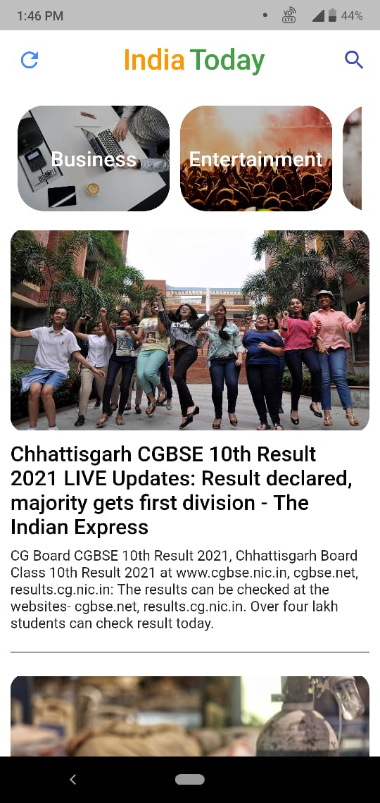

# India Today News App

A News App made using Flutter. 
Download the App from :- https://drive.google.com/file/d/1lkwB4HacVLL0vvhPsn1TQFqFNLUB_tdv/view?usp=sharing

# About
 Build an Android App Using Googles Cross Platform SDK called FLutter. FLutter uses Dart as it language as it fast. Some features of the App are displaying top Indian News from top News sources, users ka can filter news by category like sports, technology etc and users can also search for top news by typing news Keywords fo example Doge Coin.

 # Requirements 
 A Android Decice with Internet connection is required
 
 # Libraries Used
 Used some Flutter Packages to accomplish this App:
 - WebView_Flutter
 - Cached_Network_Image

# Screenshots

# Note
Some depenndencies might be deprecated if u are using Flutter 2.0. So just migrate it and upadate the pubspec,yaml file

## Getting Started With Flutter 

This project is a starting point for a Flutter application.

A few resources to get you started if this is your first Flutter project:

- [Lab: Write your first Flutter app](https://flutter.dev/docs/get-started/codelab)
- [Cookbook: Useful Flutter samples](https://flutter.dev/docs/cookbook)

For help getting started with Flutter, view our
[online documentation](https://flutter.dev/docs), which offers tutorials,
samples, guidance on mobile development, and a full API reference.
